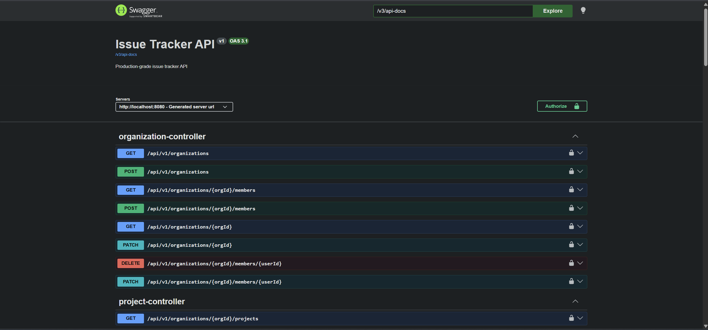
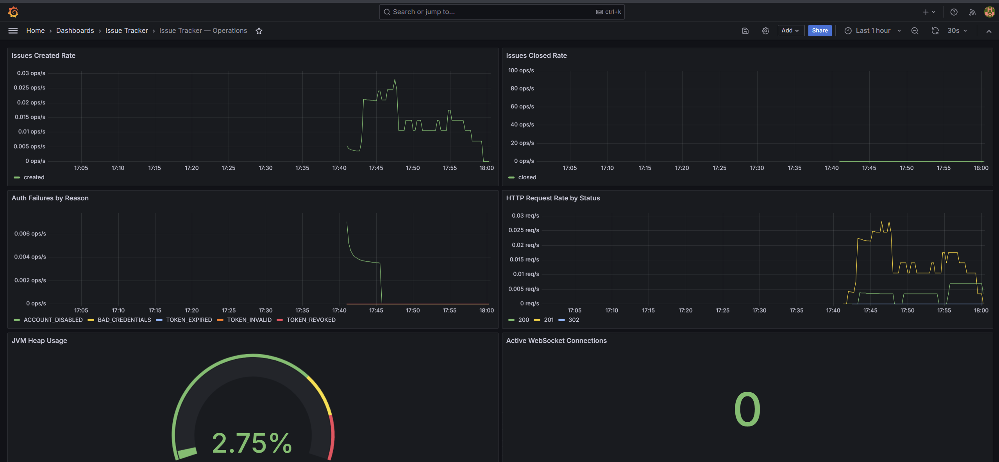

# Issue Tracker

> A production-grade multi-tenant issue tracker built with Spring Boot, PostgreSQL, Redis, and MinIO

[](https://openjdk.org/projects/jdk/21/) [](https://spring.io/projects/spring-boot) [](https://www.postgresql.org/) [](https://redis.io/) [](https://www.docker.com/) [](https://github.com/features/actions)

---

## Architecture Overview

When a user sends a request to Issue Tracker, the Spring Boot API validates the JWT, rejects blacklisted access tokens, and checks organization membership through a Redis-backed permission cache. Controllers route organization and project-scoped work into service methods that persist tenant data, issues, comments, labels, attachments, audit logs, and analytics snapshots in PostgreSQL with Liquibase-managed schema validation. Issue changes publish Redis-backed WebSocket updates, send email notifications after transaction commit, and emit Micrometer metrics. Attachments are stored through the S3 SDK against MinIO, while Actuator exposes Prometheus metrics on the management port and OTLP traces flow through the OpenTelemetry collector into Jaeger.

```
                         +----------------------+
                         |        Client        |
                         +----------+-----------+
                                    |
                                    | HTTP REST :8080
                                    v
                         +----------------------+
                         | Spring Boot REST API |
                         |  JWT + Method Auth   |
                         +---+------+-----+-----+
                             |      |     |
                 PostgreSQL  |      |     | MinIO/S3
              issues, users, |      |     | attachments
              analytics      |      |     |
                             v      v     v
                      +----------+ +---------+
                      | Postgres | |  MinIO  |
                      +----------+ +---------+
                             |
                             | Redis cache, sessions,
                             | pub/sub, ShedLock
                             v
                         +--------+
                         | Redis  |
                         +--------+

       WebSocket/STOMP : /ws
      +---------------------+
      | Local STOMP broker  |
      | /topic, /user       |
      +----------+----------+
                 |
                 | publish ws:issue-updates
                 v                        
              +-------+        fan-out        +----------------------+
              | Redis | ------------------->  | Other API pods       |
              +-------+                       | local STOMP brokers  |
                                              +----------------------+

      Spring Batch nightly job
      +-----------------------+
      | analyticsSnapshotJob  |
      +-----------+-----------+
                  |
                  v
      analytics_snapshots table

       Observability
      +------------------+       scrape :8090        +------------+
      | Actuator metrics | ------------------------> | Prometheus |
      +------------------+                           +------------+
                                                           |
                                                           v
                                                       +---------+
                                                       | Grafana |
                                                       +---------+
```

---

## Tech Stack

| Category | Technology | Purpose |
|----------|------------|---------|
| Language | Java 21 | Application runtime |
| Framework | Spring Boot 3.5.14 | REST API foundation |
| Security | Spring Security 6 + JJWT 0.12.5 | Stateless JWT auth |
| Database | PostgreSQL 16 | Primary data store |
| Migrations | Liquibase | Versioned schema changes |
| Cache | Redis 7.2 | Sessions and permissions |
| Storage | AWS SDK S3 2.25.70 + MinIO | Issue attachments |
| WebSocket | Spring WebSocket + STOMP | Live issue updates |
| Batch | Spring Batch + ShedLock 5.16.0 | Analytics snapshots |
| Mail | Spring Mail + Thymeleaf | Notification emails |
| Metrics | Micrometer + Prometheus | Application metrics |
| Tracing | OpenTelemetry + Jaeger | Request tracing |
| CI/CD | GitHub Actions + Buildpacks | Test and image publishing |

---

## Key Features

- **Multi-tenant organizations** - Organizations own projects and membership roles, and every project-scoped workflow validates organization access before returning data.
- **JWT authentication** - Access tokens are signed with issuer and audience validation, while refresh tokens are hashed in Redis and rotated on refresh.
- **Role-based permissions** - `ADMIN`, `PROJECT_MANAGER`, `DEVELOPER`, and `REPORTER` roles flow through a Redis-cached organization permission hierarchy.
- **Issue workflow** - Issues support status, priority, type, assignee, labels, watchers, story points, due dates, soft delete, and optimistic locking.
- **Audit history** - Issue creation, field updates, and deletion write audit log records for traceable change history.
- **Real-time updates** - Issue changes publish Redis-backed WebSocket events to `/topic/projects/{projectId}/issues`.
- **Attachment storage** - Multipart uploads are validated, stored through the S3 SDK against MinIO, and downloaded through presigned URLs.
- **Project analytics** - Overview, trend, and burndown endpoints use live issue counts, cached analytics queries, and nightly Spring Batch snapshots.
- **Email notifications** - Assignment and status-change events send Thymeleaf email after transaction commit through the configured mail server.
- **Production observability** - Custom Micrometer metrics, JSON logs, health probes, Prometheus alerts, Grafana dashboards, and OTLP traces are wired in.
- **Container delivery** - CI builds GHCR images, and Kubernetes manifests define two app replicas with liveness, readiness, and startup probes.
- **Test coverage gates** - Maven separates unit and `*IT` integration tests and enforces 80% service-layer line coverage during `verify`.

---

## Project Structure

```
issue-tracker/
|-- issue-tracker/              # Spring Boot Maven application
|   |-- pom.xml
|   |-- src/main/java/com/krish/issuetracker/
|   |   |-- auth/               # Registration, login, refresh, logout
|   |   |-- organization/       # Tenant and member management
|   |   |-- project/            # Project lifecycle APIs
|   |   |-- issue/              # Issue workflow and audit history
|   |   |-- comment/            # Issue comments
|   |   |-- label/              # Project labels
|   |   |-- storage/            # MinIO-backed attachments
|   |   |-- analytics/          # Overview, trends, burndown
|   |   |-- batch/              # Nightly analytics snapshots
|   |   |-- websocket/          # STOMP issue updates
|   |   |-- security/           # JWT, permissions, sessions
|   |   \-- config/             # Redis, CORS, observability
|   \-- src/main/resources/
|       |-- application.yaml
|       \-- db/changelog/       # Liquibase migrations
|-- docker-compose.yml          # Local infrastructure
|-- k8s/                        # Kubernetes manifests
|-- prometheus/                 # Scrape config and alert rules
|-- grafana/                    # Dashboard and datasource provisioning
|-- docs/screenshots/           # README screenshots
\-- otel-collector-config.yml   # OTLP to Jaeger pipeline
```

---

## Getting Started

### Prerequisites

- Java 21
- Docker Desktop
- Maven wrapper from `issue-tracker/`

### Local Development Setup

```bash
# 1. Clone the repository
git clone https://github.com/kishnahai0806/issue-tracker.git
cd issue-tracker

# 2. Create your local environment file
cp .env.example .env
# Edit .env and fill in your local values:
# - JWT_SECRET: any 32+ character string for local dev
# - POSTGRES_DB, POSTGRES_USER, POSTGRES_PASSWORD for PostgreSQL
# - STORAGE_ACCESS_KEY and STORAGE_SECRET_KEY for MinIO
# - GRAFANA_ADMIN_USER and GRAFANA_ADMIN_PASSWORD for Grafana

# 3. Start all infrastructure
docker compose up -d

# 4. Run the API with the same environment values loaded in your shell
cd issue-tracker
./mvnw spring-boot:run -Dspring-boot.run.profiles=local   # Mac/Linux
mvnw.cmd spring-boot:run -Dspring-boot.run.profiles=local  # Windows
```

> The Docker Compose bootstrap service creates the configured MinIO bucket automatically.

Once running, access the services at:

| Service | URL | Credentials |
|---------|-----|-------------|
| API | http://localhost:8080 | Bearer JWT |
| Swagger UI | http://localhost:8080/swagger-ui/index.html | Local profile only |
| Health | http://localhost:8090/actuator/health | - |
| Grafana | http://localhost:3001 | admin / admin |
| Jaeger | http://localhost:16686 | - |
| Prometheus | http://localhost:9090 | - |
| MinIO Console | http://localhost:9001 | minioadmin / minioadmin |
| MailHog | http://localhost:8025 | - |

### Running Tests

```bash
# Runs unit tests, integration tests, and JaCoCo coverage checks
cd issue-tracker
./mvnw verify        # Mac/Linux
mvnw.cmd verify      # Windows
```

---

## API Endpoints

| Method | Endpoint | Auth | Description |
|--------|----------|------|-------------|
| `POST` | `/api/v1/auth/register` | None | Register a new user |
| `POST` | `/api/v1/auth/login` | None | Login and receive tokens |
| `POST` | `/api/v1/auth/refresh` | Refresh token | Rotate refresh token and issue access token |
| `POST` | `/api/v1/auth/logout` | Bearer | Revoke refresh token and blacklist access token |
| `POST` | `/api/v1/organizations` | Bearer | Create an organization |
| `GET` | `/api/v1/organizations` | Bearer | List active organizations |
| `GET` | `/api/v1/organizations/{orgId}` | REPORTER | Get organization details |
| `PATCH` | `/api/v1/organizations/{orgId}` | ADMIN | Update organization details |
| `POST` | `/api/v1/organizations/{orgId}/members` | ADMIN | Add an organization member |
| `GET` | `/api/v1/organizations/{orgId}/members` | REPORTER | List organization members |
| `PATCH` | `/api/v1/organizations/{orgId}/members/{userId}` | ADMIN | Update member role |
| `DELETE` | `/api/v1/organizations/{orgId}/members/{userId}` | ADMIN | Remove organization member |
| `POST` | `/api/v1/organizations/{orgId}/projects` | PROJECT_MANAGER | Create a project |
| `GET` | `/api/v1/organizations/{orgId}/projects` | REPORTER | List projects |
| `GET` | `/api/v1/organizations/{orgId}/projects/{projectId}` | REPORTER | Get project details |
| `PATCH` | `/api/v1/organizations/{orgId}/projects/{projectId}` | PROJECT_MANAGER | Update project details |
| `POST` | `/api/v1/organizations/{orgId}/projects/{projectId}/archive` | PROJECT_MANAGER | Archive a project |
| `POST` | `/api/v1/organizations/{orgId}/projects/{projectId}/issues` | DEVELOPER | Create an issue |
| `GET` | `/api/v1/organizations/{orgId}/projects/{projectId}/issues` | REPORTER | List and filter issues |
| `GET` | `/api/v1/organizations/{orgId}/projects/{projectId}/issues/{issueId}` | DEVELOPER | Get issue details |
| `PATCH` | `/api/v1/organizations/{orgId}/projects/{projectId}/issues/{issueId}` | DEVELOPER | Update an issue |
| `DELETE` | `/api/v1/organizations/{orgId}/projects/{projectId}/issues/{issueId}` | PROJECT_MANAGER | Soft delete an issue |
| `POST` | `/api/v1/organizations/{orgId}/projects/{projectId}/issues/{issueId}/watchers` | REPORTER | Add issue watcher |
| `DELETE` | `/api/v1/organizations/{orgId}/projects/{projectId}/issues/{issueId}/watchers/{userId}` | REPORTER | Remove issue watcher |
| `POST` | `/api/v1/organizations/{orgId}/projects/{projectId}/issues/{issueId}/comments` | REPORTER | Add issue comment |
| `GET` | `/api/v1/organizations/{orgId}/projects/{projectId}/issues/{issueId}/comments` | REPORTER | List issue comments |
| `PATCH` | `/api/v1/organizations/{orgId}/projects/{projectId}/issues/{issueId}/comments/{commentId}` | REPORTER | Update issue comment |
| `DELETE` | `/api/v1/organizations/{orgId}/projects/{projectId}/issues/{issueId}/comments/{commentId}` | REPORTER | Delete issue comment |
| `POST` | `/api/v1/organizations/{orgId}/projects/{projectId}/labels` | PROJECT_MANAGER | Create project label |
| `GET` | `/api/v1/organizations/{orgId}/projects/{projectId}/labels` | REPORTER | List project labels |
| `PATCH` | `/api/v1/organizations/{orgId}/projects/{projectId}/labels/{labelId}` | PROJECT_MANAGER | Update project label |
| `DELETE` | `/api/v1/organizations/{orgId}/projects/{projectId}/labels/{labelId}` | PROJECT_MANAGER | Delete project label |
| `POST` | `/api/v1/organizations/{orgId}/projects/{projectId}/issues/{issueId}/attachments` | DEVELOPER | Upload issue attachment |
| `GET` | `/api/v1/organizations/{orgId}/projects/{projectId}/issues/{issueId}/attachments` | REPORTER | List issue attachments |
| `GET` | `/api/v1/organizations/{orgId}/projects/{projectId}/issues/{issueId}/attachments/{attachmentId}/download` | REPORTER | Redirect to presigned download URL |
| `DELETE` | `/api/v1/organizations/{orgId}/projects/{projectId}/issues/{issueId}/attachments/{attachmentId}` | DEVELOPER | Delete issue attachment |
| `GET` | `/api/v1/organizations/{orgId}/projects/{projectId}/analytics/overview` | REPORTER | Get project analytics overview |
| `GET` | `/api/v1/organizations/{orgId}/projects/{projectId}/analytics/trends` | REPORTER | Get project analytics trends |
| `GET` | `/api/v1/organizations/{orgId}/projects/{projectId}/analytics/burndown` | REPORTER | Get project burndown data |

Full interactive documentation is available at `/swagger-ui.html` when the local profile enables Springdoc.

---

## Environment Variables

| Variable | Description | Example |
|----------|-------------|---------|
| `SERVER_PORT` | API server port | `8080` |
| `MANAGEMENT_SERVER_PORT` | Actuator server port | `8090` |
| `SPRING_DATASOURCE_URL` | PostgreSQL connection URL | `jdbc:postgresql://localhost:5432/issue_tracker` |
| `SPRING_DATASOURCE_USERNAME` | PostgreSQL username | `issue_tracker_local` |
| `SPRING_DATASOURCE_PASSWORD` | PostgreSQL password | `local_dev_password` |
| `SPRING_REDIS_HOST` | Redis hostname | `localhost` |
| `SPRING_REDIS_PORT` | Redis port | `6379` |
| `JWT_SECRET` | JWT signing secret | `local-dev-change-me-minimum-32-characters` |
| `JWT_ISSUER` | Expected token issuer | `issue-tracker` |
| `JWT_AUDIENCE` | Expected token audience | `issue-tracker-client` |
| `JWT_ACCESS_EXPIRY_MS` | Access token lifetime | `900000` |
| `JWT_REFRESH_EXPIRY_MS` | Refresh token lifetime | `604800000` |
| `CORS_ALLOWED_ORIGINS` | Allowed browser origins | `http://localhost:3000` |
| `STORAGE_ENDPOINT` | S3-compatible storage endpoint | `http://localhost:9000` |
| `STORAGE_ACCESS_KEY` | S3 access key | `minioadmin` |
| `STORAGE_SECRET_KEY` | S3 secret key | `minioadmin` |
| `STORAGE_BUCKET_NAME` | Attachment bucket name | `issue-tracker` |
| `MAIL_HOST` | SMTP host | `localhost` |
| `MAIL_PORT` | SMTP port | `1025` |
| `OTEL_EXPORTER_OTLP_ENDPOINT` | OTLP trace endpoint | `http://localhost:4318/v1/traces` |
| `SPRINGDOC_API_DOCS_ENABLED` | OpenAPI docs toggle | `true` |
| `SWAGGER_UI_ENABLED` | Swagger UI toggle | `true` |

For production, secrets belong in Kubernetes `Secret` values or CI/CD secret storage, not in committed files.

---

## CI/CD Pipeline

GitHub Actions runs on every push to any branch and on pull requests targeting `main`. The `Test` job starts PostgreSQL 16 and Redis 7.2 service containers, sets up Java 21, caches Maven dependencies, and runs `./mvnw verify` from `issue-tracker/`. On pushes to `main`, `Build and Push Image` waits for tests, builds a Spring Boot Buildpacks image, logs in to GHCR, and publishes both `latest` and commit-SHA tags.

```
push to any branch / PR to main
        |
        v
  +-------------+
  |  Job 1      |  PostgreSQL 16 and Redis 7.2 service containers
  |   Test      |  ./mvnw verify from issue-tracker/
  +------+------+  JaCoCo service-layer coverage check
         |
         | needs
         v
  +-------------+
  |  Job 2      |  Runs only on push to main
  | build-push  |  Builds ghcr.io/kishnahai0806/issue-tracker:latest
  +-------------+  Pushes latest and commit SHA image tags
```

Docker images are published to:
- `ghcr.io/kishnahai0806/issue-tracker:latest`
- `ghcr.io/kishnahai0806/issue-tracker:<commit-sha>`

---

## Observability

Both the application and local infrastructure expose metrics, traces, dashboards, and alerts.

**Metrics** - available at `/actuator/prometheus` on port `8090`:

| Metric | Description |
|--------|-------------|
| `issues.created` | Counter for created issues |
| `issues.closed` | Counter for issues moved to `DONE` or `CLOSED` |
| `comments.added` | Counter for added comments |
| `auth.failures` | Counter tagged by authentication failure reason |
| `emails.sent` | Counter for successfully sent emails |
| `ws.connections.active` | Gauge for active WebSocket connections |
| `storage.upload.duration` | Timer for attachment upload duration |
| `file.upload.validation.failure` | Counter tagged by upload validation failure reason |
| `batch.analytics.snapshot.duration` | Timer for analytics snapshot job duration |

**Traces** - requests are sampled by Micrometer tracing and exported through OTLP HTTP to `http://localhost:4318/v1/traces`. The OpenTelemetry collector forwards spans to Jaeger, available at `http://localhost:16686`.

**Dashboards** - Grafana auto-provisions the Prometheus datasource and `grafana/dashboards/issue-tracker.json`. Access Grafana at `http://localhost:3001`.

**Alerts** - Prometheus alerting rules are defined in `./prometheus/alerts.yml` for authentication failure rate, 5xx error rate, batch job duration, file upload validation spikes, and JVM heap pressure.

---

## Screenshots

### Swagger UI - API Documentation
Interactive API documentation showing auth, organization, project, issue, comment, label, attachment, and analytics endpoints with JWT bearer authentication.



### Grafana Dashboard - Real-time Metrics
Live operational dashboard showing issue creation and closure rates, authentication failures, HTTP request rate, WebSocket connections, JVM heap usage, storage latency, and batch duration.



### Jaeger - Request Tracing
Request tracing view for spans exported from the Spring Boot application through the OpenTelemetry collector into Jaeger.


